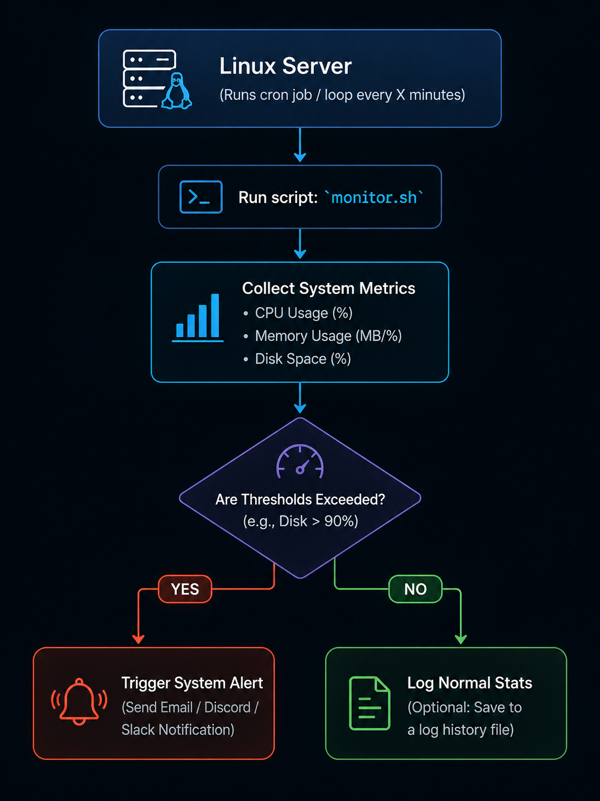

# linux-health-monitor

# Linux Health Monitor

A collection of lightweight shell scripts to monitor Linux system health (CPU, Memory, Disk) and trigger alerts.

## How it Works
Here is a quick look at the monitoring flow:

